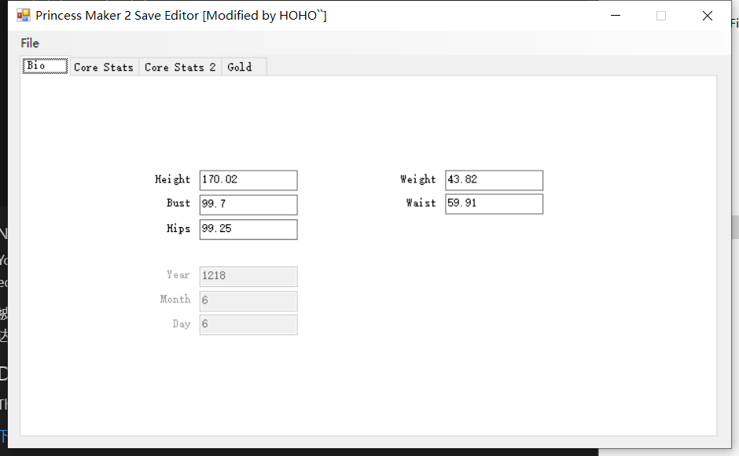
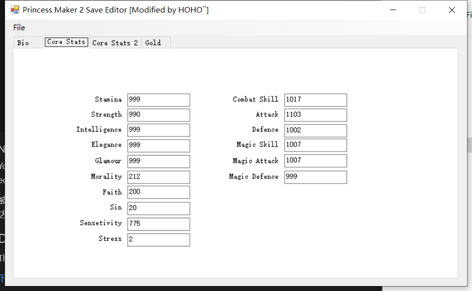
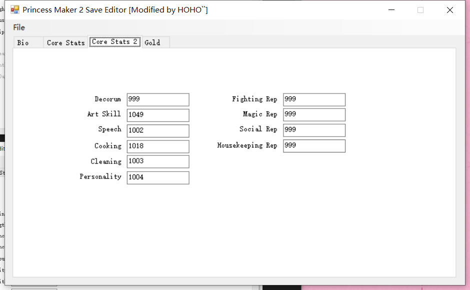

# 美少女梦工厂2 重置版 Steam 存档修改器

An open-source save file editor for Princess Maker 2.

Modified by HOHO``, original source code form [dl471, Game English Version](https://github.com/dl471/pm2-save-editor/)

小学时候玩的Dos游戏之一，偶然发现Steam上出了重制版，还有一个隐藏的父嫁结局，果断做了一个适合游戏中文版的修改器，把这结局最快的速度跑了一遍。

## Steps

    1. start the game and load an original game save.
    2. use the save editor to load the saving file.
    3. modify the values and save the file in the save editor.
    4. reload the saving file from the game, the game will show an incorrect data message box.
    5. ignore the message and click "OK". (save is now loaded in-game and data applied.)
    6. save the game for loadable directly by game.

    1. 启动新游戏保存或者加载原有游戏进度。
    2. 使用编辑器加载需要修改的游戏文件。
    3. 修改需要的数值，并保存。
    4. 游戏中重新选择该进度并读取，游戏会提示数据不正确。
    5. 实际上数据已经应用到游戏，点击确定忽略该提示。
    6. 通过游戏的保存功能，再次保存游戏文件以便下次游戏能够直接读取。

### NOTICE

known issue: saving file won't be able to start a new game instance.

You won't be able to load the modified save the file directly which modified by the save editor, that's why you need to in-game loads the modified file and save it again.

被编辑器直接修改的存档不能在启动新游戏加载，只能通过已有的游戏进度，加载文件来达到修改存档中数值部分。

## Download

The latest version can be downloaded from the [releases page](https://github.com/nov30th/pm2-save-editor/releases).

[下载](https://github.com/nov30th/pm2-save-editor/releases)

## Compatability

This save editor is compatible with:
* Princess Maker 2 Refine (Chinese Version, might be working in other versions)
* 美少女梦工厂2重置版 （中文测试通过，其他语言理论上也可）

## Requirements

Requires Microsoft .NET Framework 4.5.2.

## Screenshots

